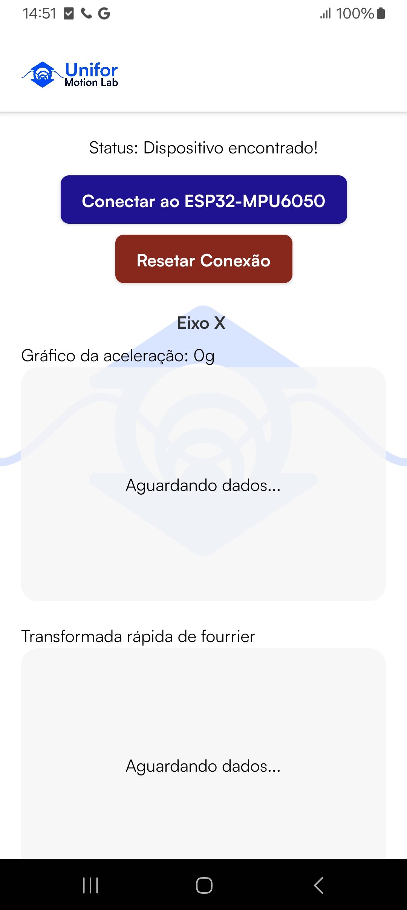

# UNIFOR Motion Lab
#### Aplicativo mobile em React Native, que lê dados de um acelerômetro via BLE e plota os gráficos em tempo real usando ESP32 + MPU6050   

## Funcionalidades
- Conexão BLE manual com ESP32
- Leitura dos valores dos três eixos (X, Y, e Z) do acelerômetro
- Plotagem dos gráficos de aceleração e transformada rápida de fourrier em tempo real
- Reset e reconexão manual com o ESP32
- Histórico dos dados de aceleração exibidos

 

## Tecnologias utilizadas
O projeto **Unifor Motion Lab** foi desenvolvido utilizando um conjunto de tecnologias modernas para garantir desempenho, portabilidade e visualização eficiente dos dados em tempo real.

 

| 🧩 Tecnologia | 💡 Função no Projeto |
|---------------|----------------------|
| **React Native (0.74.5)** | Framework principal para desenvolvimento do aplicativo mobile multiplataforma. |
| **Expo (~51.0.28)** | Ferramenta que simplifica o desenvolvimento, build e execução do app em Android/iOS. |
| **React (18.2.0)** | Biblioteca base para construção da interface e componentes. |
| **react-native-ble-plx (^3.5.0)** | Responsável pela comunicação Bluetooth Low Energy (BLE) com o ESP32. |
| **@shopify/react-native-skia (1.2.3)** | Renderização gráfica avançada e desenho de gráficos em tempo real. |
| **fft.js (^4.0.4)** | Realiza a Transformada Rápida de Fourier (FFT) para análise de frequência dos dados do sensor. |
| **react-native-quick-base64 (^2.2.2)** | Decodifica os dados BLE transmitidos em base64 de forma eficiente. |
| **expo-font (~12.0.10)** | Gerenciamento e carregamento de fontes personalizadas. |
| **expo-status-bar (~1.12.1)** | Controle e personalização da barra de status do dispositivo. |
| **@babel/core (^7.20.0)** | Ferramenta de build/transpilação moderna usada pelo ambiente React Native. |

 

## Instalação e uso

 

<code>git clone https://github.com/WalterGomes13/acelerometro-app.git</code> 
<code>cd acelerometro-app</code> 
<code>npm install</code> 
<code>npx expo run:android</code> 
>Dica: verifique se o Bluetooth e as permissões de localização estão ativados antes de iniciar o app.

 

## Hardware necessário
- ESP32 DevKit V1
- Sensor MPU6050
- Alimentação 5v

   

## Configuração do ESP32

O app se conecta a um ESP32 com sensor MPU6050 via BLE.  
O firmware do ESP32 lê os dados de aceleração (~20Hz) e envia para o app pelo serviço BLE `6E400001-B5A3-F393-E0A9-E50E24DCCA9E`.  

> O código completo do ESP32 está disponível em [`/esp32-firmware`](./esp32-firmware).

 

## Capturas de tela

